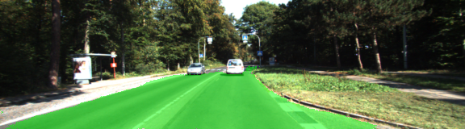
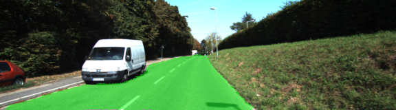
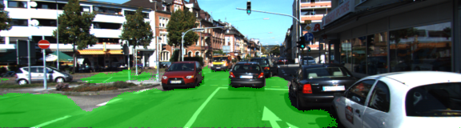
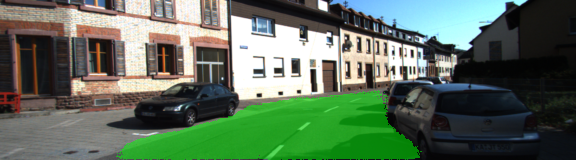
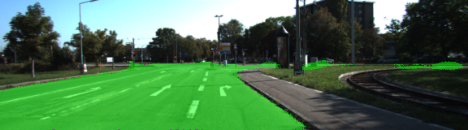
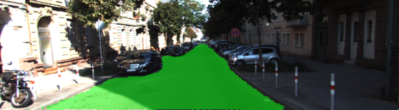

## CarND-Semantic-Segmentation-Project

Overview
---
This project is part of the Udacity Self-Driving Car Engineer Nanodegree program Term 3.

If you are looking for instructions how to build and setup the project environment, please see the [INSTRUCTIONS.md](./INSTRUCTIONS.md) for more details.

### Project Goals
The goals/steps of this project are the following:
* Identify drivable space from dashcam images
* Build a fully convolutional neural network
* Use the VGG-16 network as an encoder

### Results

### Reflection

#### Network architecture
The network model is based on the paper [Fully Convolutional Networks for Semantic Segmentation](https://people.eecs.berkeley.edu/~jonlong/long_shelhamer_fcn.pdf). It utilizes a pretrained VGG-16 network as the encoder and performs layer skipping within the decoding (upsample) part.

#### Hyperparameters

* Epochs: 15
* Learning Rate: 0.0001
* Batch Size: 4  (because of GPU memory restrictions)
* Keep Probability: 0.5
* Adam Optimizer
